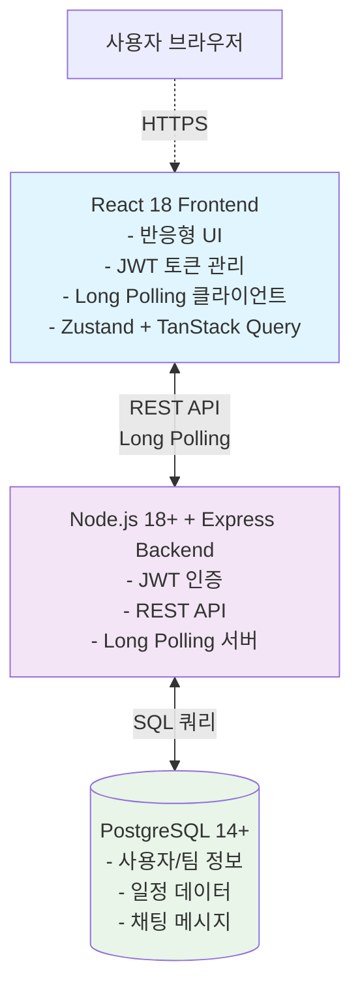
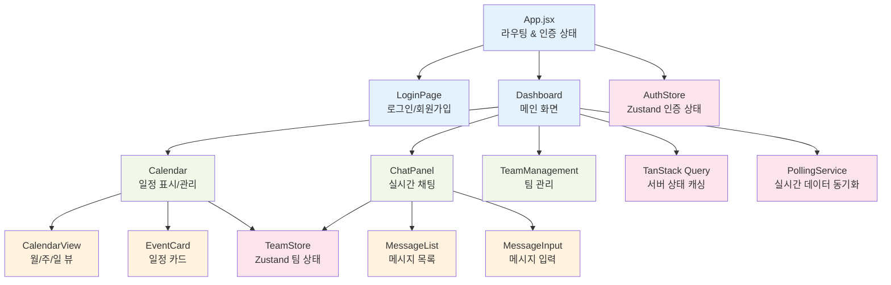
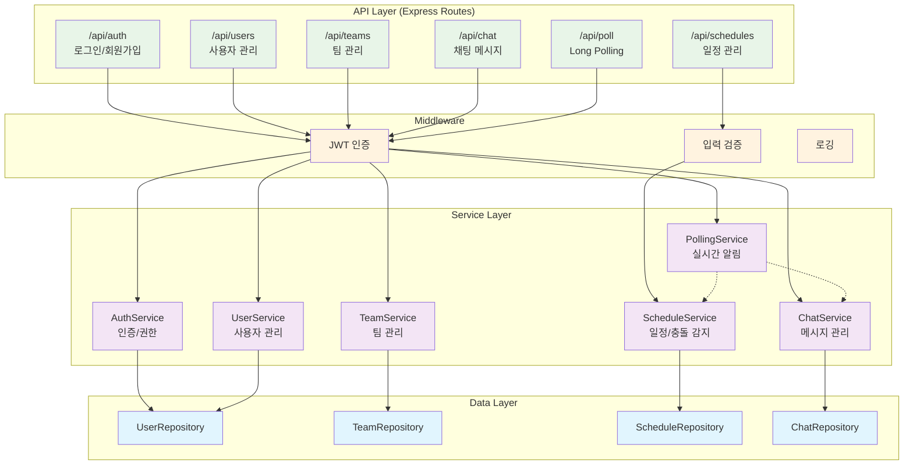
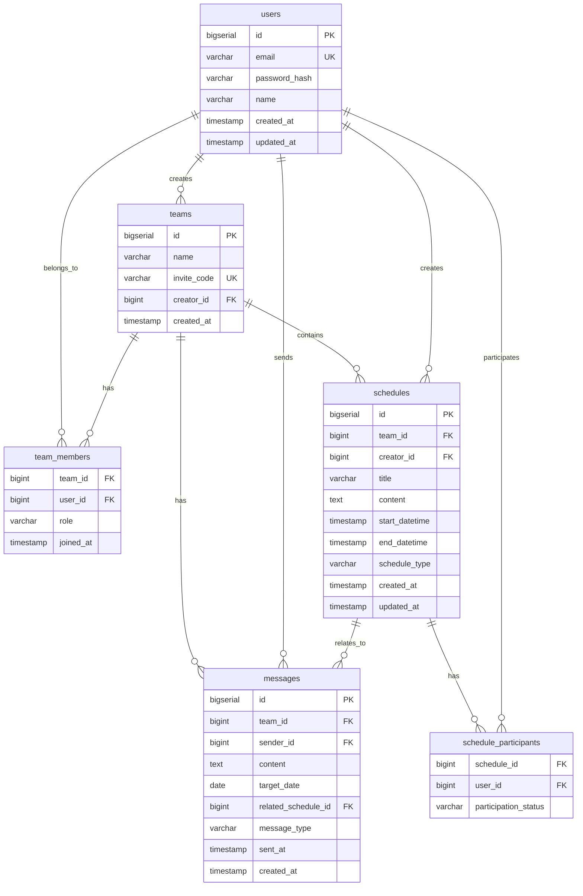
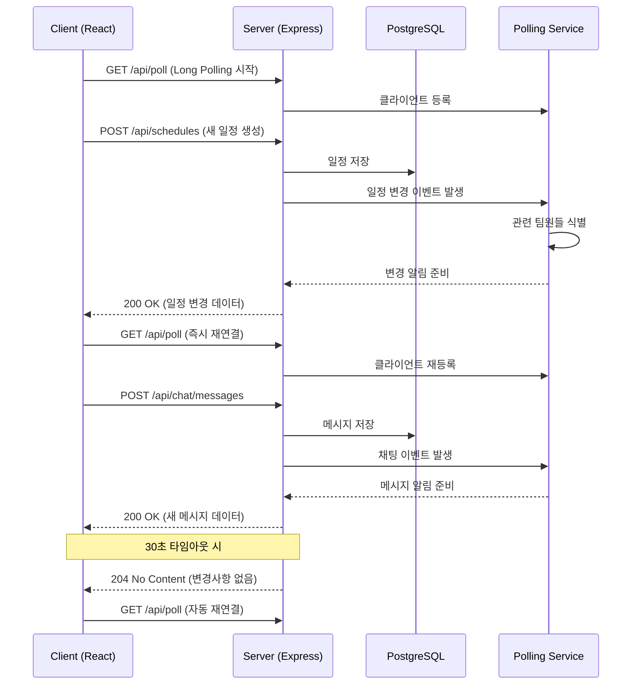
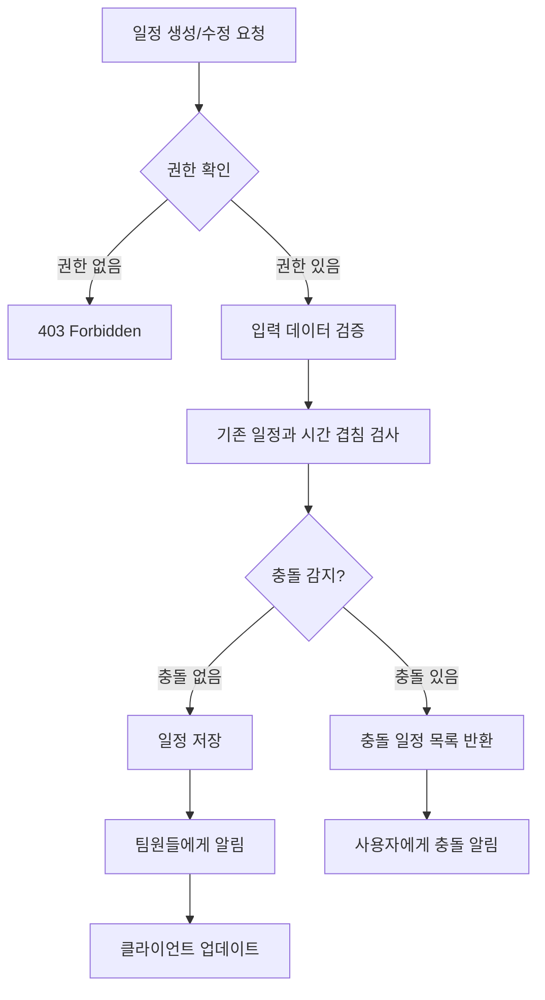
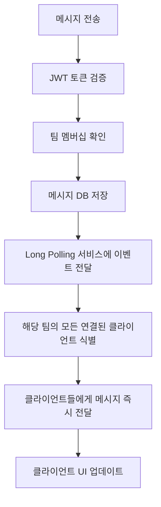

# Team CalTalk 기술 아키텍처 다이어그램

## 1. 전체 시스템 아키텍처 (고수준)

**설명**: 3-tier 웹 아키텍처로 React 18 프론트엔드(Zustand + TanStack Query), Node.js 18+ 백엔드, PostgreSQL 14+ 데이터베이스로 구성. Long Polling을 통한 실시간 통신으로 WebSocket 없이도 실시간 기능 구현.

## 2. 프론트엔드 아키텍처 (컴포넌트 구조)

**설명**: React 18 컴포넌트 기반 구조로 인증, 캘린더, 채팅 기능을 독립적인 모듈로 분리. Zustand를 통한 클라이언트 상태 관리, TanStack Query를 통한 서버 상태 캐싱, Long Polling 서비스로 실시간 동기화.

## 3. 백엔드 아키텍처 (API 및 서비스 레이어)

**설명**: 계층형 아키텍처로 API → 미들웨어 → 서비스 → 데이터 레이어로 분리. JWT 기반 인증과 Repository 패턴으로 데이터 접근 추상화. Long Polling 서비스가 실시간 알림 담당.

## 4. 데이터베이스 ERD (핵심 테이블)

**설명**: 정규화된 관계형 스키마로 사용자, 팀, 일정, 채팅 엔티티 간의 관계 정의. 팀 멤버십과 일정 참가자를 별도 테이블로 관리하여 다대다 관계 지원.

## 5. 실시간 통신 플로우 (Long Polling)

**설명**: Long Polling을 통한 실시간 통신으로 WebSocket 없이도 1초 내 메시지 전달 보장. 클라이언트가 서버에 지속적인 연결을 유지하다가 이벤트 발생 시 즉시 응답 받고 재연결하는 구조.

## 6. 주요 기능별 데이터 플로우

### 일정 충돌 감지 플로우

### 실시간 채팅 플로우

## 7. 기술 스택 요약

| 레이어 | 기술 | 역할 |
|--------|------|------|
| 프론트엔드 | React 18 | UI 컴포넌트, 상태 관리 |
| 백엔드 | Node.js + Express | REST API, 비즈니스 로직 |
| 데이터베이스 | PostgreSQL | 관계형 데이터 저장 |
| 인증 | JWT | 토큰 기반 인증 |
| 실시간 통신 | Long Polling | 실시간 알림/채팅 |
| 배포 | 클라우드 웹서비스 | MVP 서비스 운영 |

## 8. MVP 구현 우선순위

1. **인증 시스템**: 회원가입/로그인, JWT 토큰 관리
2. **기본 일정 관리**: CRUD, 캘린더 뷰, 충돌 감지
3. **실시간 채팅**: Long Polling 기반 메시지 전송/수신
4. **팀 관리**: 팀 생성, 초대 코드, 멤버 관리
5. **통합 UI**: 캘린더와 채팅을 하나의 화면에서 제공

이 아키텍처는 MVP 범위에 맞춰 복잡성을 최소화하면서도 확장 가능한 구조로 설계되었습니다. Long Polling을 통해 WebSocket 없이도 실시간 기능을 구현하여 배포 환경의 제약을 극복하고, 3000개 팀 동시 지원이라는 목표를 달성할 수 있습니다.