# Team CalTalk 데이터베이스 ERD

**문서 버전**: 2.0
**최종 업데이트**: 2025-10-01
**데이터베이스**: PostgreSQL 17.6

## 📊 구현 현황 (2025-10-01 기준)

### ✅ 실제 데이터베이스 상태
- **PostgreSQL 버전**: 17.6
- **데이터베이스명**: team_caltalk
- **스키마**: public
- **테이블**: 6개 (users, teams, team_members, schedules, schedule_participants, messages)
- **인덱스**: 21개 (성능 최적화)
- **제약 조건**: 완전 구현 (CHECK, UNIQUE, FOREIGN KEY)
- **GIST 인덱스**: 일정 충돌 감지용 tsrange 인덱스 구현

### 📦 주요 구현 특징
- ✅ **btree_gist 확장**: 일정 시간 범위 검색 최적화
- ✅ **CASCADE 삭제**: 데이터 무결성 보장
- ✅ **메시지 타입 확장**: normal, schedule_request, schedule_approved, schedule_rejected (4가지)
- ✅ **복합 인덱스**: 팀별/날짜별 효율적 조회
- ✅ **트리거 함수**: updated_at 자동 갱신

## 개요

Team CalTalk의 PostgreSQL 데이터베이스 설계는 팀 중심의 일정 관리와 실시간 채팅 기능을 지원하며, 3000개 팀의 동시 사용을 고려한 확장 가능한 구조로 설계되었습니다.

## 핵심 설계 원칙

- **역할 기반 접근 제어**: 팀장과 팀원의 권한 분리
- **일정 충돌 감지**: 효율적인 시간 겹침 검사
- **팀별 데이터 격리**: 팀 간 데이터 보안 보장
- **성능 최적화**: 인덱스 기반 빠른 조회
- **확장성**: 대용량 데이터 처리 고려

## ERD (Entity Relationship Diagram)

```mermaid
erDiagram
    users {
        bigserial id PK "사용자 고유 ID"
        varchar(255) email UK "이메일 (유니크)"
        varchar(100) name "사용자명 (2-30자)"
        varchar(255) password_hash "암호화된 비밀번호"
        timestamp created_at "생성일시"
        timestamp updated_at "수정일시"
    }

    teams {
        bigserial id PK "팀 고유 ID"
        varchar(100) name "팀명 (2-30자)"
        text description "팀 설명"
        varchar(10) invite_code UK "초대 코드 (유니크)"
        bigint creator_id FK "팀 생성자 ID"
        timestamp created_at "생성일시"
        timestamp updated_at "수정일시"
    }

    team_members {
        bigserial id PK "팀 멤버 고유 ID"
        bigint team_id FK "팀 ID"
        bigint user_id FK "사용자 ID"
        varchar(20) role "역할: leader, member"
        timestamp joined_at "팀 참여일시"
        timestamp created_at "생성일시"
    }

    schedules {
        bigserial id PK "일정 고유 ID"
        varchar(200) title "일정 제목 (2-100자)"
        text content "일정 내용 (최대 1000자)"
        timestamp start_datetime "시작 일시"
        timestamp end_datetime "종료 일시"
        varchar(20) schedule_type "일정 유형: personal, team"
        bigint creator_id FK "생성자 ID"
        bigint team_id FK "팀 ID (팀 일정인 경우)"
        timestamp created_at "생성일시"
        timestamp updated_at "수정일시"
    }

    schedule_participants {
        bigserial id PK "참가자 고유 ID"
        bigint schedule_id FK "일정 ID"
        bigint user_id FK "참가자 사용자 ID"
        varchar(20) participation_status "참가 상태: confirmed, pending, declined"
        timestamp created_at "생성일시"
    }

    messages {
        bigserial id PK "메시지 고유 ID"
        bigint team_id FK "팀 ID"
        bigint sender_id FK "발신자 ID"
        text content "메시지 내용 (최대 500자)"
        date target_date "대상 날짜 (채팅 날짜별 분리)"
        bigint related_schedule_id FK "관련 일정 ID (선택적)"
        varchar(50) message_type "메시지 유형: normal, schedule_request, schedule_approved, schedule_rejected"
        timestamp sent_at "발송 일시"
        timestamp created_at "생성일시"
    }

    %% 관계 정의
    users ||--o{ teams : "creates"
    users ||--o{ team_members : "belongs_to"
    users ||--o{ schedules : "creates"
    users ||--o{ schedule_participants : "participates"
    users ||--o{ messages : "sends"

    teams ||--o{ team_members : "has"
    teams ||--o{ schedules : "contains"
    teams ||--o{ messages : "contains"

    schedules ||--o{ schedule_participants : "has"
    schedules ||--o{ messages : "relates_to"

    team_members }o--|| users : "references"
    team_members }o--|| teams : "references"

    schedule_participants }o--|| schedules : "references"
    schedule_participants }o--|| users : "references"

    messages }o--|| teams : "references"
    messages }o--|| users : "references"
    messages }o--o| schedules : "references"
```



## 테이블별 상세 설명

### 1. users (사용자)
```sql
CREATE TABLE users (
    id BIGSERIAL PRIMARY KEY,
    email VARCHAR(255) UNIQUE NOT NULL,
    name VARCHAR(100) NOT NULL CHECK (LENGTH(name) BETWEEN 2 AND 30),
    password_hash VARCHAR(255) NOT NULL,
    created_at TIMESTAMP DEFAULT CURRENT_TIMESTAMP,
    updated_at TIMESTAMP DEFAULT CURRENT_TIMESTAMP
);

-- 인덱스
CREATE INDEX idx_users_email ON users(email);
```

**설계 포인트**:
- 이메일 기반 인증으로 중복 방지
- 비밀번호는 해시화하여 저장
- 이름 길이 제약 (2-30자)

### 2. teams (팀)
```sql
CREATE TABLE teams (
    id BIGSERIAL PRIMARY KEY,
    name VARCHAR(100) NOT NULL CHECK (LENGTH(name) BETWEEN 2 AND 30),
    description TEXT,
    invite_code VARCHAR(10) UNIQUE NOT NULL,
    creator_id BIGINT NOT NULL REFERENCES users(id) ON DELETE CASCADE,
    created_at TIMESTAMP DEFAULT CURRENT_TIMESTAMP,
    updated_at TIMESTAMP DEFAULT CURRENT_TIMESTAMP
);

-- 인덱스
CREATE INDEX idx_teams_invite_code ON teams(invite_code);
CREATE INDEX idx_teams_creator_id ON teams(creator_id);
```

**설계 포인트**:
- 초대 코드로 팀 참여 관리
- 팀 생성자는 자동으로 팀장 권한
- 팀명 길이 제약 (2-30자)

### 3. team_members (팀 멤버)
```sql
CREATE TABLE team_members (
    id BIGSERIAL PRIMARY KEY,
    team_id BIGINT NOT NULL REFERENCES teams(id) ON DELETE CASCADE,
    user_id BIGINT NOT NULL REFERENCES users(id) ON DELETE CASCADE,
    role VARCHAR(20) NOT NULL DEFAULT 'member' CHECK (role IN ('leader', 'member')),
    joined_at TIMESTAMP DEFAULT CURRENT_TIMESTAMP,
    created_at TIMESTAMP DEFAULT CURRENT_TIMESTAMP,
    UNIQUE(team_id, user_id)
);

-- 인덱스
CREATE INDEX idx_team_members_team_id ON team_members(team_id);
CREATE INDEX idx_team_members_user_id ON team_members(user_id);
CREATE INDEX idx_team_members_role ON team_members(team_id, role);
```

**설계 포인트**:
- 팀-사용자 다대다 관계 구현
- 역할 기반 권한 관리 (leader/member)
- 복합 유니크 제약으로 중복 가입 방지

### 4. schedules (일정)
```sql
CREATE TABLE schedules (
    id BIGSERIAL PRIMARY KEY,
    title VARCHAR(200) NOT NULL CHECK (LENGTH(title) BETWEEN 2 AND 100),
    content TEXT CHECK (LENGTH(content) <= 1000),
    start_datetime TIMESTAMP NOT NULL,
    end_datetime TIMESTAMP NOT NULL,
    schedule_type VARCHAR(20) NOT NULL CHECK (schedule_type IN ('personal', 'team')),
    creator_id BIGINT NOT NULL REFERENCES users(id) ON DELETE CASCADE,
    team_id BIGINT REFERENCES teams(id) ON DELETE CASCADE,
    created_at TIMESTAMP DEFAULT CURRENT_TIMESTAMP,
    updated_at TIMESTAMP DEFAULT CURRENT_TIMESTAMP,

    -- 제약 조건
    CHECK (end_datetime > start_datetime),
    CHECK (end_datetime <= start_datetime + INTERVAL '7 days'),
    CHECK ((schedule_type = 'team' AND team_id IS NOT NULL) OR
           (schedule_type = 'personal' AND team_id IS NULL))
);

-- 인덱스 (충돌 감지 최적화)
CREATE INDEX idx_schedules_datetime_range ON schedules USING GIST (
    tsrange(start_datetime, end_datetime)
);
CREATE INDEX idx_schedules_creator_datetime ON schedules(creator_id, start_datetime);
CREATE INDEX idx_schedules_team_datetime ON schedules(team_id, start_datetime) WHERE team_id IS NOT NULL;
CREATE INDEX idx_schedules_type ON schedules(schedule_type);
```

**설계 포인트**:
- 일정 충돌 감지를 위한 GIST 인덱스 사용
- 일정 유형별 조건부 제약
- 최대 7일 일정 기간 제한
- 시간 범위 유효성 검사

### 5. schedule_participants (일정 참가자)
```sql
CREATE TABLE schedule_participants (
    id BIGSERIAL PRIMARY KEY,
    schedule_id BIGINT NOT NULL REFERENCES schedules(id) ON DELETE CASCADE,
    user_id BIGINT NOT NULL REFERENCES users(id) ON DELETE CASCADE,
    participation_status VARCHAR(20) NOT NULL DEFAULT 'confirmed'
        CHECK (participation_status IN ('confirmed', 'pending', 'declined')),
    created_at TIMESTAMP DEFAULT CURRENT_TIMESTAMP,
    UNIQUE(schedule_id, user_id)
);

-- 인덱스
CREATE INDEX idx_schedule_participants_schedule ON schedule_participants(schedule_id);
CREATE INDEX idx_schedule_participants_user ON schedule_participants(user_id);
CREATE INDEX idx_schedule_participants_user_status ON schedule_participants(user_id, participation_status);
```

**설계 포인트**:
- 일정-참가자 다대다 관계
- 참가 상태 관리로 향후 확장 대비
- 중복 참가 방지

### 6. messages (메시지)
```sql
CREATE TABLE messages (
    id BIGSERIAL PRIMARY KEY,
    team_id BIGINT NOT NULL REFERENCES teams(id) ON DELETE CASCADE,
    sender_id BIGINT NOT NULL REFERENCES users(id) ON DELETE CASCADE,
    content TEXT NOT NULL CHECK (LENGTH(content) <= 500),
    target_date DATE NOT NULL,
    related_schedule_id BIGINT REFERENCES schedules(id) ON DELETE SET NULL,
    message_type VARCHAR(50) NOT NULL DEFAULT 'normal'
        CHECK (message_type IN ('normal', 'schedule_request', 'schedule_approved', 'schedule_rejected')),
    sent_at TIMESTAMP DEFAULT CURRENT_TIMESTAMP,
    created_at TIMESTAMP DEFAULT CURRENT_TIMESTAMP
);

-- 인덱스 (날짜별 채팅 조회 최적화)
CREATE INDEX idx_messages_team_date ON messages(team_id, target_date, sent_at);
CREATE INDEX idx_messages_sender ON messages(sender_id);
CREATE INDEX idx_messages_schedule ON messages(related_schedule_id) WHERE related_schedule_id IS NOT NULL;
CREATE INDEX idx_messages_type ON messages(team_id, message_type);
CREATE INDEX idx_messages_sent_at ON messages(sent_at);
```

**설계 포인트**:
- 날짜별 채팅 분리로 효율적 조회
- 일정 관련 메시지 추적
- **메시지 유형 4가지 지원**: normal, schedule_request, schedule_approved, schedule_rejected
- 팀별 데이터 격리
- 일정 변경 요청 워크플로우 지원 (요청 → 승인/거절)

## 핵심 쿼리 최적화

### 1. 일정 충돌 감지 쿼리
```sql
-- 사용자의 특정 시간대 일정 충돌 검사
WITH user_schedules AS (
    SELECT s.* FROM schedules s
    JOIN schedule_participants sp ON s.id = sp.schedule_id
    WHERE sp.user_id = ?
    AND sp.participation_status = 'confirmed'
)
SELECT * FROM user_schedules
WHERE tsrange(start_datetime, end_datetime) &&
      tsrange(?::timestamp, ?::timestamp);
```

### 2. 팀 캘린더 조회 쿼리
```sql
-- 특정 팀의 월간 일정 조회
SELECT
    s.*,
    u.name as creator_name,
    array_agg(pu.name) as participants
FROM schedules s
JOIN users u ON s.creator_id = u.id
LEFT JOIN schedule_participants sp ON s.id = sp.schedule_id
LEFT JOIN users pu ON sp.user_id = pu.id
WHERE s.team_id = ?
    AND s.start_datetime >= ?
    AND s.start_datetime < ?
GROUP BY s.id, u.name
ORDER BY s.start_datetime;
```

### 3. 날짜별 채팅 이력 조회
```sql
-- 특정 팀의 특정 날짜 채팅 조회
SELECT
    m.*,
    u.name as sender_name,
    s.title as related_schedule_title
FROM messages m
JOIN users u ON m.sender_id = u.id
LEFT JOIN schedules s ON m.related_schedule_id = s.id
WHERE m.team_id = ?
    AND m.target_date = ?
ORDER BY m.sent_at;
```

## 성능 고려사항

### 1. 파티셔닝 전략
- **messages 테이블**: target_date 기준 월별 파티션
- **schedules 테이블**: created_at 기준 분기별 파티션 (대용량 시)

### 2. 인덱스 전략
- **복합 인덱스**: 자주 함께 사용되는 컬럼 조합
- **부분 인덱스**: NULL 값이 많은 컬럼 최적화
- **GIST 인덱스**: 시간 범위 검색 최적화

### 3. 캐싱 전략
- 팀 멤버 목록: Redis 캐싱 (TTL: 1시간)
- 자주 조회되는 일정: 애플리케이션 레벨 캐싱

## 확장성 고려사항

### 1. 수평 확장
- 팀 ID 기준 샤딩 준비
- 읽기 전용 복제본 활용

### 2. 데이터 아카이빙
- 1년 이상 된 메시지 아카이브 테이블 이관
- 완료된 일정 별도 보관

### 3. 모니터링 지표
- 테이블별 크기 및 성장률
- 인덱스 효율성 추적
- 쿼리 성능 모니터링

## 📋 실제 구현된 인덱스 목록

### users 테이블 (3개)
```sql
CREATE UNIQUE INDEX users_pkey ON users USING btree (id);
CREATE UNIQUE INDEX users_email_key ON users USING btree (email);
CREATE INDEX idx_users_email ON users USING btree (email);
```

### teams 테이블 (4개)
```sql
CREATE UNIQUE INDEX teams_pkey ON teams USING btree (id);
CREATE UNIQUE INDEX teams_invite_code_key ON teams USING btree (invite_code);
CREATE INDEX idx_teams_invite_code ON teams USING btree (invite_code);
CREATE INDEX idx_teams_creator_id ON teams USING btree (creator_id);
```

### team_members 테이블 (5개)
```sql
CREATE UNIQUE INDEX team_members_pkey ON team_members USING btree (id);
CREATE UNIQUE INDEX team_members_team_id_user_id_key ON team_members USING btree (team_id, user_id);
CREATE INDEX idx_team_members_team_id ON team_members USING btree (team_id);
CREATE INDEX idx_team_members_user_id ON team_members USING btree (user_id);
CREATE INDEX idx_team_members_role ON team_members USING btree (team_id, role);
```

### schedules 테이블 (5개)
```sql
CREATE UNIQUE INDEX schedules_pkey ON schedules USING btree (id);
CREATE INDEX idx_schedules_datetime_range ON schedules USING gist (tsrange(start_datetime, end_datetime));
CREATE INDEX idx_schedules_creator_datetime ON schedules USING btree (creator_id, start_datetime);
CREATE INDEX idx_schedules_team_datetime ON schedules USING btree (team_id, start_datetime) WHERE (team_id IS NOT NULL);
CREATE INDEX idx_schedules_type ON schedules USING btree (schedule_type);
```

### schedule_participants 테이블 (4개)
```sql
CREATE UNIQUE INDEX schedule_participants_pkey ON schedule_participants USING btree (id);
CREATE UNIQUE INDEX schedule_participants_schedule_id_user_id_key ON schedule_participants USING btree (schedule_id, user_id);
CREATE INDEX idx_schedule_participants_schedule ON schedule_participants USING btree (schedule_id);
CREATE INDEX idx_schedule_participants_user ON schedule_participants USING btree (user_id);
```

### messages 테이블 (5개)
```sql
CREATE UNIQUE INDEX messages_pkey ON messages USING btree (id);
CREATE INDEX idx_messages_team_date ON messages USING btree (team_id, target_date, sent_at);
CREATE INDEX idx_messages_sender ON messages USING btree (sender_id);
CREATE INDEX idx_messages_schedule ON messages USING btree (related_schedule_id) WHERE (related_schedule_id IS NOT NULL);
CREATE INDEX idx_messages_type ON messages USING btree (team_id, message_type);
```

**총 인덱스**: 26개 (Primary Key 6개 포함)

이 ERD는 Team CalTalk의 핵심 기능을 지원하면서도 확장 가능하고 성능 최적화된 데이터베이스 구조를 제공합니다.